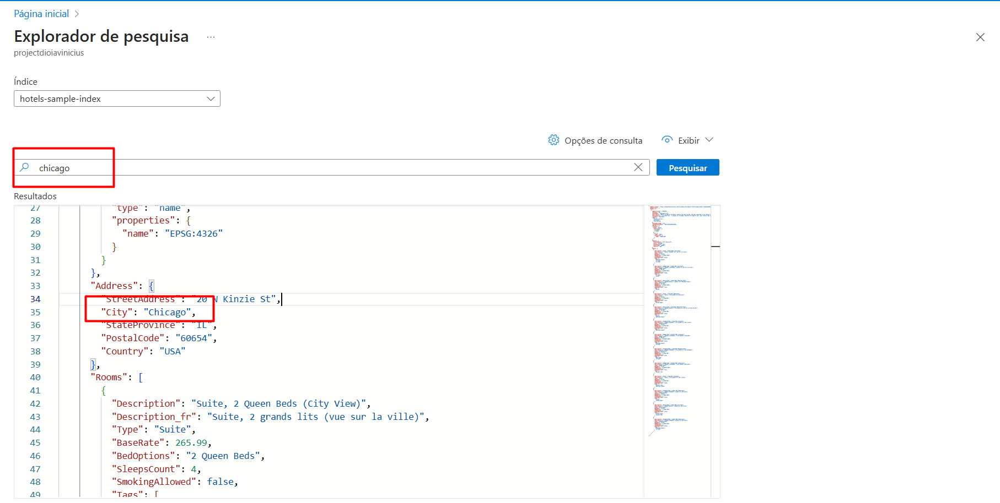

# **Projeto: Busca Inteligente com Azure Cognitive Search**

Este projeto demonstra a utilização do Azure Cognitive Search para realizar buscas avançadas em dados hoteleiros, utilizando o índice de exemplo `hotels-sample-index`.

---

## **Busca por Localização - Chicago**

**Índice utilizado:** `hotels-sample-index` (disponível no Azure Cognitive Search)

### **Consulta Realizada**
```search=Chicago```

### **Resultado Obtido**
```json
{
  "value": [
    {
      "HotelName": "Secret Point Motel",
      "Address": {
        "StreetAddress": "20 W Kinzie St",
        "City": "Chicago",
        "StateProvince": "IL",
        "PostalCode": "60654",
        "Country": "USA"
      }
    }
  ]
}
```

#### **Demonstração**


---

## **Principais Aprendizados**

1. **Busca Eficiente**  
   - Encontrou resultados precisos com uma consulta simples
   - Funcionou mesmo sem especificar o campo (busca em todos os campos pesquisáveis)

2. **Estrutura de Dados**  
   - Capacidade de retornar objetos aninhados (endereço completo)
   - Formato JSON padronizado para fácil consumo

3. **Praticidade**  
   - Índice pré-configurado permite testes rápidos
   - Interface do Search Explorer simplifica a experimentação

---

## **Aplicações Práticas**

1. **Sistemas de Reservas**  
   - Busca combinada com filtros:  
     

2. **Análise de Dados**  
   - Identificação de concentração hoteleira por região

3. **Integrações**  
   - Conexão com aplicativos móveis ou sites

---

